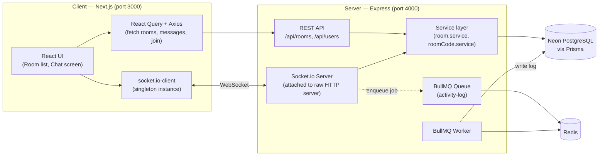
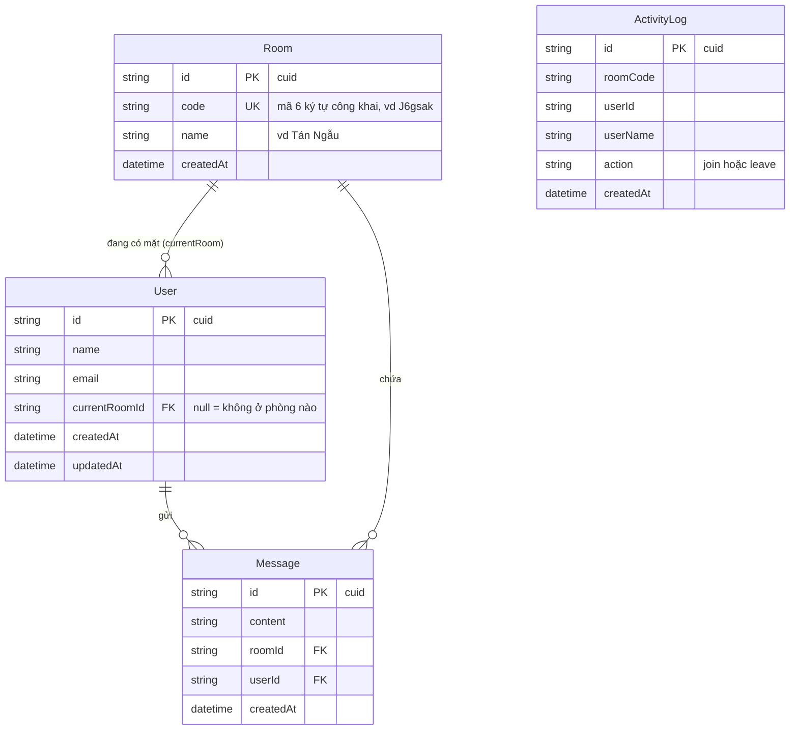
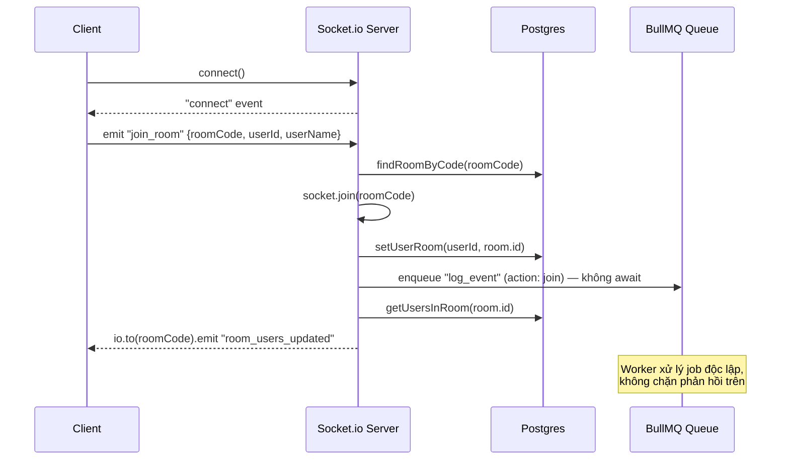

# 💬 Socket.io Chat Practice


Ứng dụng chat realtime được xây dựng để đào sâu kiến thức WebSocket/Socket.io — từ vòng đời kết nối, cơ chế broadcast theo phòng, presence, cho tới các vấn đề thực tế khi kết hợp Socket.io với React (stale closure, race condition) và xử lý job nền không chặn luồng chính (BullMQ).

## Demo

> _(Thêm ảnh chụp màn hình hoặc GIF demo ở đây khi có)_

---

## ✨ Tính năng nổi bật

- **Phòng chat cố định**: 5 phòng được seed sẵn (Tán Ngẫu, Phiếm, Hóng Giá Vàng...), mỗi phòng có mã code 6 ký tự tự sinh (loại bỏ ký tự dễ nhầm: `0/O`, `1/l/I`).
- **Join không cần đăng nhập**: Chỉ cần điền Tên & Email, danh tính được lưu cục bộ qua `localStorage` (sử dụng `useSyncExternalStore` để đồng bộ đúng chuẩn React, tránh lỗi hydration SSR).
- **Chat realtime 2 chiều**: Gửi bằng phím Enter hoặc nút Send, hiển thị ngay lập tức cho mọi người trong phòng.
- **Presence**: Danh sách người đang online cập nhật theo thời gian thực khi có người join/leave/disconnect.
- **Lịch sử chat**: 50 tin nhắn gần nhất tải qua REST API khi vào phòng, sau đó tiếp nhận tin mới qua socket.
- **Activity log nền**: Ghi lại lịch sử join/leave qua BullMQ, không chặn phản hồi realtime của user.
- **Test tự động & CI/CD**: Mọi PR/push đều tự động chạy lint, unit test và build để kiểm tra trước khi merge.

---

## 🚀 Công nghệ sử dụng (Tech Stack)

**Frontend**
- Next.js 15 (App Router) + React 19
- Tailwind CSS, Sass
- React Query v5 + Axios (Data fetching cho REST API)
- socket.io-client (Kết nối realtime)

**Backend**
- Node.js + Express (REST API)
- Socket.io (Được gắn trực tiếp vào raw `http.Server`, độc lập với Express app)
- Prisma ORM + Neon PostgreSQL (Database)
- BullMQ + Redis (ioredis) (Xử lý job nền ghi activity log)
- Jest + ts-jest (Unit test, mock Prisma Client)

**CI/CD**
- GitHub Actions — 2 workflow riêng biệt (`server-ci.yml`, `client-ci.yml`), trigger theo path filter, chạy lint, test, và build tự động.

---

## 📐 Kiến trúc hệ thống

Hệ thống được tách thành 2 service độc lập, giao tiếp thông qua REST API (dữ liệu tĩnh) và WebSocket (dữ liệu realtime):



**Vì sao tách 2 service riêng?**
Next.js serverless functions không giữ được persistent connection tốt cho WebSocket. Việc tách riêng một Express server giúp Socket.io duy trì kết nối hai chiều ổn định, độc lập với vòng đời request/response của Next.js — đồng thời cho phép scale hai phần này độc lập sau này.

---

## 🗄️ Thiết kế Cơ sở dữ liệu (ERD)



### Các quyết định thiết kế đáng chú ý:
- **`User.currentRoomId` thay vì `Room.liveUsers[]`**: Quan hệ 1 user → nhiều room qua field FK dễ truy vấn và luôn nhất quán hơn so với việc lưu mảng ID lồng trong bảng SQL. Muốn biết "ai đang online trong phòng X" chỉ cần `User.findMany({ where: { currentRoomId: X } })`.
- **`Room.code` (public) tách biệt với `Room.id` (nội bộ)**: `id` dùng `cuid()` không đoán được thứ tự, không lộ ra URL/FE. `code` là chuỗi 6 ký tự dễ đọc, dùng để chia sẻ và làm tên nhóm broadcast của Socket.io.
- **`ActivityLog` độc lập, không có foreign key tới `Room`/`User`**: Vì đây là dữ liệu ghi qua BullMQ worker (bất đồng bộ), việc cố tình lưu `roomCode`/`userName` dạng phẳng (denormalized) giúp tránh phải join lại lúc cần audit, và loại bỏ rủi ro race condition nếu record gốc đã bị xóa/đổi tại thời điểm worker xử lý job.

---

## 🔌 Giao thức Socket.io (Custom Events)

Ngoài 2 sự kiện built-in (`connect`/`connection`, `disconnect`), ứng dụng định nghĩa các event riêng theo quy ước `snake_case`:

| Hướng | Event | Payload | Mục đích |
|---|---|---|---|
| Client → Server | `join_room` | `{ roomCode, userId, userName }` | Xin gia nhập 1 phòng |
| Client → Server | `leave_room` | `{ roomCode, userId, userName }` | Chủ động rời phòng |
| Client → Server | `send_message` | `{ roomCode, userId, content }` | Gửi tin nhắn |
| Server → Room | `room_users_updated` | `{ users[] }` | Broadcast danh sách online mới nhất |
| Server → Room | `new_message` | `{ message }` | Broadcast tin nhắn mới |
| Server → 1 client | `join_room_error` | `{ message }` | Báo lỗi riêng cho người vừa xin join |

### Luồng join phòng đầy đủ:



**Chi tiết**: `socket.io` room (nhãn broadcast tạm thời trong bộ nhớ) được đặt tên **trùng với `Room.code`** trong DB để map 1-1, đơn giản hóa việc định tuyến broadcast.

---

## 📁 Cấu trúc thư mục

```text
socketio-chat-henry/
├── .github/workflows/   # CI pipelines (server-ci.yml, client-ci.yml)
├── client/              # Frontend (Next.js)
│   └── src/
│       ├── app/         # Next.js App Router pages (/, /room/[code])
│       ├── components/  # MessageBubble, Header, etc.
│       └── lib/         # api.ts, socket.ts, useRoomSocket.ts, useCurrentUser.ts
└── server/              # Backend (Express + Socket.io)
    ├── prisma/
    │   ├── schema.prisma # Định nghĩa model: User, Room, Message, ActivityLog
    │   └── seed.ts       # Seed 5 phòng cố định với mã code tự sinh
    └── src/
        ├── config/       # Prisma client singleton, Redis connection
        ├── queues/       # BullMQ Queue + Worker (xử lý activity log)
        ├── routes/       # REST endpoints (room, message, user)
        ├── services/     # Logic nghiệp vụ thuần, tách khỏi Express/Socket.io
        │   └── tests/    # Unit test (Jest, mock Prisma)
        └── sockets/      # Toàn bộ Socket.io event handlers
```

---

## ⚙️ Cài đặt & Chạy cục bộ (Local Development)

### 1. Clone dự án

```bash
git clone https://github.com/DatPHP/socketio-chat-henry.git
cd socketio-chat-henry
```

### 2. Cài đặt dependencies

```bash
cd server && npm install
cd ../client && npm install
```

### 3. Cấu hình biến môi trường

Tạo file `.env` trong thư mục `server/`:

```env
# server/.env
PORT=4000
DATABASE_URL="postgresql://<user>:<pass>@<host>-pooler/<db>?sslmode=require"
DIRECT_URL="postgresql://<user>:<pass>@<host>/<db>?sslmode=require"
REDIS_URL="redis://localhost:6379"
CLIENT_URL="http://localhost:3000"
```

Tạo file `.env.local` trong thư mục `client/`:

```env
# client/.env.local
NEXT_PUBLIC_SOCKET_URL=http://localhost:4000
NEXT_PUBLIC_API_URL=http://localhost:4000/api
```

### 4. Khởi động Redis (bằng Docker)

```bash
docker run -d --name redis-chat -p 6379:6379 redis:7-alpine
```

### 5. Migrate & Seed Database

```bash
cd server
npx prisma migrate dev
npx prisma db seed
```

### 6. Khởi chạy ứng dụng

```bash
# Mở Terminal 1 (chạy Backend)
cd server && npm run dev

# Mở Terminal 2 (chạy Frontend)
cd client && npm run dev
```

Truy cập ứng dụng tại: `http://localhost:3000`.

---

## 🧪 Kiểm thử (Testing)

```bash
cd server
npm test           # Chạy unit test 1 lần
npm run test:watch # Chạy ở chế độ watch
```

Unit test tập trung vào **service layer thuần** (`roomCode.service.ts`, `room.service.ts`), sử dụng `jest.mock` để giả lập Prisma Client — không cần kết nối DB thật. Test suite bao gồm cả **regression test** cho lỗi `PrismaClientKnownRequestError (P2025)` từng gặp trong quá trình phát triển, đảm bảo lỗi không xuất hiện lại.

---

## 🐛 Các vấn đề thực tế đã xử lý

Quá trình xây dựng dự án này đi kèm với việc phát hiện và xử lý nhiều vấn đề thực tế, mỗi vấn đề đều mang lại 1 bài học cụ thể:

| Vấn đề | Nguyên nhân | Hướng giải quyết |
|---|---|---|
| Server crash khi update user không tồn tại | Không bọc `try/catch` quanh logic async trong `socket.on()` | Bắt riêng mã lỗi Prisma `P2025`, log cảnh báo thay vì để lỗi lan ra ngoài gây crash server. |
| `userId` rỗng khi join/leave phòng | `useEffect` chạy trước khi `currentUser` load xong từ localStorage; `useRef` không tự cập nhật giá trị mới | Thêm cờ `enabled` để guard effect, dùng closure qua dependency array thay vì `useRef`. |
| Log "rời phòng" bị in trùng 2 lần | Cả sự kiện `leave_room` (tự định nghĩa) và `disconnect` (built-in) cùng dẫn tới một hành động dọn dẹp | Đánh dấu `socket.data` đã xử lý để lần gọi thứ 2 tự bỏ qua. |
| Git coi `client/` là submodule | `create-next-app` tự động chạy `git init` bên trong thư mục con | Xóa `client/.git`, dùng lệnh `git rm --cached` rồi add lại thư mục đúng cách. |
| ESLint chặn CI (`react-hooks/set-state-in-effect`) | Gọi `setState` trực tiếp trong `useEffect` khi đọc localStorage | Chuyển sang `useSyncExternalStore` — API chuẩn của React cho việc đồng bộ dữ liệu từ nguồn bên ngoài. |

---

## 🗺️ Lộ trình phát triển (Đã hoàn thành 9/9 giai đoạn)

- [x] **Phase 0** — Khởi tạo cấu trúc project (server + client riêng biệt)
- [x] **Phase 1** — Thiết kế Prisma schema, migrate, seed 5 phòng cố định
- [x] **Phase 2** — Socket.io server cơ bản, vòng đời connect/disconnect
- [x] **Phase 3** — REST API (rooms, messages) + Axios + React Query
- [x] **Phase 4** — Trang chọn phòng + form Name/Email
- [x] **Phase 5** — Logic Socket.io cốt lõi: join/leave/broadcast/presence
- [x] **Phase 6** — UI chat hoàn chỉnh, realtime 2 chiều
- [x] **Phase 7** — BullMQ: xử lý activity log nền, không chặn socket chính
- [x] **Phase 8** — Jest unit test, bao gồm regression test
- [x] **Phase 9** — CI/CD tự động với GitHub Actions

---

## 📄 License

Dự án này được phân phối dưới giấy phép MIT. Xem chi tiết tại file [LICENSE](LICENSE). (Nếu chưa có, vui lòng coi như mã nguồn mở tự do).
